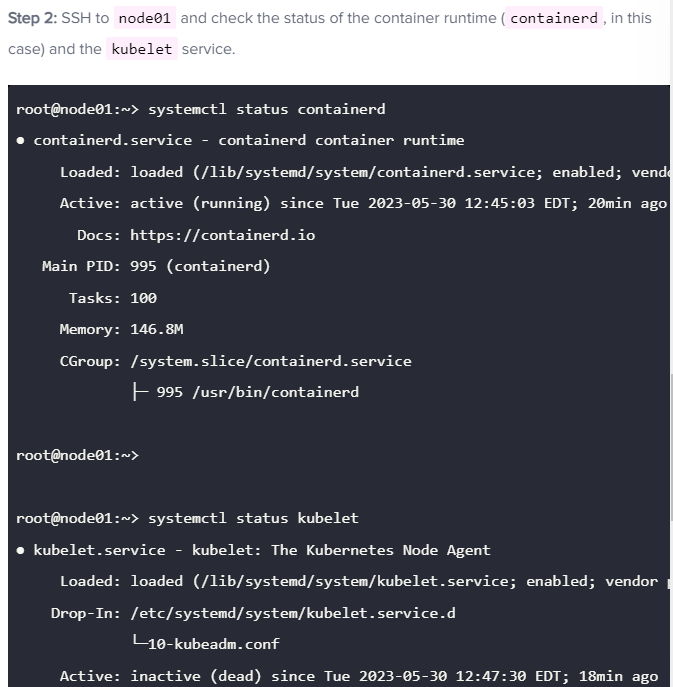

Mock Exam - 1
--------------
**Question 1:**
Deploy a pod named nginx-pod using the nginx:alpine image.

Once done, click on the Next Question button in the top right corner of this panel. You may navigate back and forth freely between all questions. Once done with all questions, click on End Exam. Your work will be validated at the end and score shown. Good Luck!

Name: nginx-pod
Image: nginx:alpine

**Solution:
Use the command: kubectl run nginx-pod --image=nginx:alpine**

**Question 2:**
Deploy a messaging pod using the redis:alpine image with the labels set to tier=msg.

Pod Name: messaging
Image: redis:alpine
Labels: tier=msg

**Solution: Use the command kubectl run messaging --image=redis:alpine -l tier=msg**

**Question 3:**
Create a namespace named apx-x9984574.
Namespace: apx-x9984574

**Solution: Run the command: kubectl create namespace apx-x9984574**

**Question 4:**
Get the list of nodes in JSON format and store it in a file at /opt/outputs/nodes-z3444kd9.json.

**Solution: Run the command: kubectl get nodes -o json > /opt/outputs/nodes-z3444kd9.json**

**Question 5:**
Create a service messaging-service to expose the messaging application within the cluster on port 6379.

Use imperative commands.
Service: messaging-service
Port: 6379
Type: ClusterIp
Use the right labels

**Solution:
Run the command: kubectl expose pod messaging --port=6379 --name messaging-service**

**Question 6:**
Create a deployment named hr-web-app using the image kodekloud/webapp-color with 2 replicas.

Name: hr-web-app
Image: kodekloud/webapp-color
Replicas: 2

**Solution: Run the command: kubectl create deployment hr-web-app --image=kodekloud/webapp-color --replicas=2**

**Question 7:**
Create a static pod named static-busybox on the controlplane node that uses the busybox image and the command sleep 1000.

Name: static-busybox
Image: busybox

**Solution: Create a pod definition file in the manifests directory. For that use command kubectl run --restart=Never --image=busybox static-busybox --dry-run=client -oyaml --command -- sleep 1000 > /etc/kubernetes/manifests/static-busybox.yaml**

**Question 8:**
Create a POD in the finance namespace named temp-bus with the image redis:alpine.

Name: temp-bus
Image Name: redis:alpine

**Solution: Run the command: kubectl run temp-bus --image=redis:alpine --namespace=finance --restart=Never**

**Question 9:**
A new application orange is deployed. There is something wrong with it. Identify and fix the issue.

**Solution:**
To know more details of orange pod:

**kubectl describe po orange**
and look under the initContainers section. There is an issue with the given command.

**Command:
sh
-c
sleeeep 2;**

In the above, we need to correct the sleeeep command.

To update the pod with an easiest way by running command:

**kubectl edit po orange**
It's not possible to update the changes in the running pod so after saving the changes. It will create a temporary file in the default location /tmp/.

Use that manifest file and replace with the existing pod:

**kubectl replace -f /tmp/kubectl-edit-xxxx.yaml --force**
Above command will delete the existing pod and will recreate the new pod with latest changes.

**Question 10:**
Expose the hr-web-app as service hr-web-app-service application on port 30082 on the nodes on the cluster.

The web application listens on port 8080.

Name: hr-web-app-service
Type: NodePort
Endpoints: 2
Port: 8080
NodePort: 30082

**Solution:**
Run the command: **kubectl expose deployment hr-web-app --type=NodePort --port=8080 --name=hr-web-app-service --dry-run=client -o yaml > hr-web-app-service.yaml** to generate a service definition file.

Now, in generated service definition file add the nodePort field with the given port number under the ports section and create a service.

**Question 11:**
Use JSON PATH query to retrieve the osImages of all the nodes and store it in a file /opt/outputs/nodes_os_x43kj56.txt.

**Solution:**
**Run the command: kubectl get nodes -o jsonpath='{.items[*].status.nodeInfo.osImage}' > /opt/outputs/nodes_os_x43kj56.txt**

The osImages are under the nodeInfo section under status of each node.

**Question 12:**
Create a Persistent Volume with the given specification: -

Volume name: pv-analytics
Storage: 100Mi
Access mode: ReadWriteMany
Host path: /pv/data-analytics

Solution manifest file to create a persistent volume pv-analytics as follows:

apiVersion: v1
kind: PersistentVolume
metadata:
name: pv-analytics
spec:
  capacity:
    storage: 100Mi
  volumeMode: Filesystem
  accessModes:
  - ReadWriteMany
  hostPath:
    path: /pv/data-analytics

---
Mock Exam - 2
--------------

**Question : 1**
**Take a backup of the etcd cluster and save it to /opt/etcd-backup.db.**

**Solution:**
Run the following command to take a backup:
**export ETCDCTL_API=3**
**etcdctl snapshot save --endpoints https://[127.0.0.1]:2379 --cacert /etc/kubernetes/pki/etcd/ca.crt --cert /etc/kubernetes/pki/etcd/server.crt --key=/etc/kubernetes/pki/etcd/server.key  /opt/etcd-backup.db**

**Question 2:**
**Create a Pod called redis-storage with image: redis:alpine with a Volume of type emptyDir that lasts for the life of the Pod.

Specs on the below.
Pod named 'redis-storage' created
Pod 'redis-storage' uses Volume type of emptyDir
Pod 'redis-storage' uses volumeMount with mountPath = /data/redis**

**Solution:**
Use the command kubectl run and create a pod definition file for redis-storage pod and add volume.
Alternatively, run the command:
**kubectl run redis-storage --image=redis:alpine --dry-run=client -oyaml > redis-storage.yaml**
and add volume emptyDir in it.

Solution manifest file to create a pod redis-storage as follows:

**Question 3:**
**Create a new pod called super-user-pod with image busybox:1.28. Allow the pod to be able to set system_time.

The container should sleep for 4800 seconds.
Pod: super-user-pod
Container Image: busybox:1.28
Is SYS_TIME capability set for the container?**

**Solution:**
Solution manifest file to create a pod super-user-pod as follows:

**Question 4:**
**A pod definition file is created at /root/CKA/use-pv.yaml. Make use of this manifest file and mount the persistent volume called pv-1. Ensure the pod is running and the PV is bound.

mountPath: /data
persistentVolumeClaim Name: my-pvc
persistentVolume Claim configured correctly
pod using the correct mountPath
pod using the persistent volume claim?**

**solution:**
Add a persistentVolumeClaim definition to pod definition file.
Solution manifest file to create a pvc my-pvc as follows:

**Question 5:**
**Create a new deployment called nginx-deploy, with image nginx:1.16 and 1 replica. Next upgrade the deployment to version 1.17 using rolling update.

Deployment : nginx-deploy. Image: nginx:1.16
Image: nginx:1.16
Task: Upgrade the version of the deployment to 1:17
Task: Record the changes for the image upgrade**

**Solution:**

Explore the --record option while creating the deployment while working with the deployment definition file. Then make use of the kubectl apply command to create or update the deployment.

To create a deployment definition file nginx-deploy:

**kubectl create deployment nginx-deploy --image=nginx:1.16 --dry-run=client -o yaml > deploy.yaml**
To create a resource from definition file and to record:

**kubectl apply -f deploy.yaml --record**
To view the history of deployment nginx-deploy:

**kubectl rollout history deployment nginx-deploy**
To upgrade the image to next given version:

**kubectl set image deployment/nginx-deploy nginx=nginx:1.17 --record**
To view the history of deployment nginx-deploy:

**kubectl rollout history deployment nginx-deploy**

**Question 6:**
**Create a new user called john. Grant him access to the cluster. John should have permission to create, list, get, update and delete pods in the development namespace . The private key exists in the location: /root/CKA/john.key and csr at /root/CKA/john.csr.

Important Note: As of kubernetes 1.19, the CertificateSigningRequest object expects a signerName.
Please refer the documentation to see an example. The documentation tab is available at the top right of terminal.
CSR: john-developer Status:Approved
Role Name: developer, namespace: development, Resource: Pods
Access: User 'john' has appropriate permissions**

**Solution:**
**kubectl create role developer --resource=pods --verb=create,list,get,update,delete --namespace=development**

**kubectl create rolebinding developer-role-binding --role=developer --user=john --namespace=development**
To verify the permission from kubectl utility tool:
**kubectl auth can-i update pods --as=john --names**

**Question 7:**
**Create a nginx pod called nginx-resolver using image nginx, expose it internally with a service called nginx-resolver-service. Test that you are able to look up the service and pod names from within the cluster. Use the image: busybox:1.28 for dns lookup. Record results in /root/CKA/nginx.svc and /root/CKA/nginx.pod

Pod: nginx-resolver created
Service DNS Resolution recorded correctly
Pod DNS resolution recorded correctly**

**Solution:**
Use the command kubectl run and create a nginx pod and busybox pod. Resolve it, nginx service and its pod name from busybox pod.

To create a pod nginx-resolver and expose it internally:

**kubectl run nginx-resolver --image=nginx
kubectl expose pod nginx-resolver --name=nginx-resolver-service --port=80 --target-port=80 --type=ClusterIP**
To create a pod test-nslookup. Test that you are able to look up the service and pod names from within the cluster:

**kubectl run test-nslookup --image=busybox:1.28 --rm -it --restart=Never -- nslookup nginx-resolver-service
kubectl run test-nslookup --image=busybox:1.28 --rm -it --restart=Never -- nslookup nginx-resolver-service > /root/CKA/nginx.svc**
Get the IP of the nginx-resolver pod and replace the dots(.) with hyphon(-) which will be used below.

**kubectl get pod nginx-resolver -o wide
kubectl run test-nslookup --image=busybox:1.28 --rm**

**Question 8:**
**Create a static pod on node01 called nginx-critical with image nginx and make sure that it is recreated/restarted automatically in case of a failure.

Use /etc/kubernetes/manifests as the Static Pod path for example.
static pod configured under /etc/kubernetes/manifests ?
Pod nginx-critical-node01 is up and running**

**Solution:**
To create a static pod called nginx-critical by using below command:

**kubectl run nginx-critical --image=nginx --dry-run=client -o yaml > static.yaml**
Copy the contents of this file or use scp command to transfer this file from controlplane to node01 node.

**root@controlplane:~# scp static.yaml node01:/root/**
To know the IP Address of the node01 node:

**root@controlplane:~# kubectl get nodes -o wide**

**Perform SSH**
**root@controlplane:~# ssh node01
OR
root@controlplane:~# ssh <IP of node01>
On node01 node:**

Check if static pod directory is present which is /etc/kubernetes/manifests, if it's not present then create it.

**root@node01:~# mkdir -p /etc/kubernetes/manifests**
Add that complete path to the staticPodPath field in the kubelet config.yaml file.

**root@node01:~# vi /var/lib/kubelet/config.yaml**
now, move/copy the static.yaml to path /etc/kubernetes/manifests/.

**root@node01:~# cp /root/static.yaml /etc/kubernetes/manifests/**
Go back to the controlplane node and check the status of static pod:

**root@node01:~# exit
logout
root@controlplane:~# kubectl get pods** 

---
Mock Exam - 3
--------------

**Question 1:**
Create a new service account with the name pvviewer. Grant this Service account access to list all PersistentVolumes in the cluster by creating an appropriate cluster role called pvviewer-role and ClusterRoleBinding called pvviewer-role-binding.
Next, create a pod called pvviewer with the image: redis and serviceAccount: pvviewer in the default namespace.

ServiceAccount: pvviewer
ClusterRole: pvviewer-role
ClusterRoleBinding: pvviewer-role-binding
Pod: pvviewer
Pod configured to use ServiceAccount pvviewer ?

**Solution:**
Pods authenticate to the API Server using ServiceAccounts. If the serviceAccount name is not specified, the default service account for the namespace is used during a pod creation.

Reference: https://kubernetes.io/docs/tasks/configure-pod-container/configure-service-account/

Now, create a service account pvviewer:

kubectl create serviceaccount pvviewer
To create a clusterrole:

kubectl create clusterrole pvviewer-role --resource=persistentvolumes --verb=list
To create a clusterrolebinding:

kubectl create clusterrolebinding pvviewer-role-binding --clusterrole=pvviewer-role --serviceaccount=default:pvviewer
Solution manifest file to create a new pod called pvviewer as follows:

**Question 2:**
**List the InternalIP of all nodes of the cluster. Save the result to a file /root/CKA/node_ips.
Answer should be in the format: InternalIP of controlplane<space>InternalIP of node01 (in a single line)**

**Solution:**
Explore the jsonpath loop.
**kubectl get nodes -o jsonpath='{.items[*].status.addresses[?(@.type=="InternalIP")].address}' > /root/CKA/node_ips**

**Question 3:**
Create a pod called multi-pod with two containers.
Container 1, name: alpha, image: nginx
Container 2: name: beta, image: busybox, command: sleep 4800

Environment Variables:
container 1:
name: alpha

Container 2:
name: beta

Pod Name: multi-pod
Container 1: alpha
Container 2: beta
Container beta commands set correctly?
Container 1 Environment Value Set
Container 2 Environment Value Set

**Solution:**
Solution manifest file to create a multi-container pod multi-pod as follows:

**Question 4:**
Create a Pod called non-root-pod , image: redis:alpine
runAsUser: 1000
fsGroup: 2000

**Solution:**
Solution manifest file to create a pod called non-root-pod as follows:

**Question 5:**
We have deployed a new pod called np-test-1 and a service called np-test-service. Incoming connections to this service are not working. Troubleshoot and fix it.
Create NetworkPolicy, by the name ingress-to-nptest that allows incoming connections to the service over port 80.

Important: Don't delete any current objects deployed.

**Solution:**
Solution manifest file to create a network policy ingress-to-nptest as follows:

**Question 6:**
Taint the worker node node01 to be Unschedulable. Once done, create a pod called dev-redis, image redis:alpine, to ensure workloads are not scheduled to this worker node. Finally, create a new pod called prod-redis and image: redis:alpine with toleration to be scheduled on node01.

key: env_type, value: production, operator: Equal and effect: NoSchedule
Key = env_type
Value = production
Effect = NoSchedule
pod 'dev-redis' (no tolerations) is not scheduled on node01?
Create a pod 'prod-redis' to run on node01

**Solution:**
To add taints on the node01 worker node:

**kubectl taint node node01 env_type=production:NoSchedule**
Now, deploy dev-redis pod and to ensure that workloads are not scheduled to this node01 worker node.

**kubectl run dev-redis --image=redis:alpine**
To view the node name of recently deployed pod:

**kubectl get pods -o wide**
Solution manifest file to deploy new pod called prod-redis with toleration to be scheduled on node01 worker node.

**Question 7:**
Create a pod called hr-pod in hr namespace belonging to the production environment and frontend tier .
image: redis:alpine

Use appropriate labels and create all the required objects if it does not exist in the system already.
hr-pod labeled with environment production?
hr-pod labeled with tier frontend?

Solution :
Create a namespace if it doesn't exist:

**kubectl create namespace hr**
and then create a hr-pod with given details:

**kubectl run hr-pod --image=redis:alpine --namespace=hr --la**

**Question 8:**
A kubeconfig file called super.kubeconfig has been created under /root/CKA. There is something wrong with the configuration. Troubleshoot and fix it.

Fix /root/CKA/super.kubeconfig

**Solution:**
Verify host and port for kube-apiserver are correct.

Open the super.kubeconfig in vi editor.

Change the 9999 port to 6443 and run the below command to verify:

**kubectl cluster-info --kubeconfig=/root/CKA/super.kubeconfig**

**Question 9:**
We have created a new deployment called nginx-deploy. scale the deployment to 3 replicas. Has the replica's increased? Troubleshoot the issue and fix it.

deployment has 3 replicas

**Solution:**
Use the command kubectl scale to increase the replica count to 3.

**kubectl scale deploy nginx-deploy --replicas=3**
The controller-manager is responsible for scaling up pods of a replicaset. If you inspect the control plane components in the kube-system namespace, you will see that the controller-manager is not running.

**kubectl get pods -n kube-system**
The command running inside the controller-manager pod is incorrect.
After fix all the values in the file and wait for controller-manager pod to restart.

Alternatively, you can run sed command to change all values at once:

**sed -i 's/kube-contro1ler-manager/kube-controller-manager/g' /etc/kubernetes/manifests/kube-controller-manager.yaml**
This will fix the issues in controller-manager yaml file.

At last, inspect the deployment by using below command:

**kubectl get deploy**

---
Lighting Lab
--------------

**Question 1:**
Upgrade the current version of kubernetes from 1.26.0 to 1.27.0 exactly using the kubeadm utility. Make sure that the upgrade is carried out one node at a time starting with the controlplane node. To minimize downtime, the deployment gold-nginx should be rescheduled on an alternate node before upgrading each node.

Upgrade controlplane node first and drain node node01 before upgrading it. Pods for gold-nginx should run on the controlplane node subsequently.
Cluster Upgraded?
pods 'gold-nginx' running on controlplane?

**Solution:**
Here is the solution for this task. Please note that the output of these commands have not been added here.

On the controlplane node:

**root@controlplane:~# kubectl drain controlplane --ignore-daemonsets
root@controlplane:~# apt update
root@controlplane:~# apt-get install kubeadm=1.27.0-00
root@controlplane:~# kubeadm upgrade plan v1.27.0
root@controlplane:~# kubeadm upgrade apply v1.27.0
root@controlplane:~# apt-get install kubelet=1.27.0-00
root@controlplane:~# systemctl daemon-reload
root@controlplane:~# systemctl restart kubelet
root@controlplane:~# kubectl uncordon controlplane**
Before draining node01, we need to remove the taint from the controlplane node.

Identify the taint first.
**root@controlplane:~# kubectl describe node controlplane | grep -i taint**

Remove the taint with help of "kubectl taint" command.
**root@controlplane:~# kubectl taint node controlplane node-role.kubernetes.io/control-plane:NoSchedule-**

Verify it, the taint has been removed successfully.
**root@controlplane:~# kubectl describe node controlplane | grep -i taint**

Now, drain the node01 as follows: -

**root@controlplane:~# kubectl drain node01 --ignore-daemonsets
SSH to the node01 and perform the below steps as follows: -
root@node01:~# apt update
root@node01:~# apt-get install kubeadm=1.27.0-00
root@node01:~# kubeadm upgrade node
root@node01:~# apt-get install kubelet=1.27.0-00
root@node01:~# systemctl daemon-reload
root@node01:~# systemctl restart kubelet**

To exit from the specific node, type exit or logout on the terminal.

Back on the controlplane node: -

**root@controlplane:~# kubectl uncordon node01
root@controlplane:~# kubectl get pods -o wide | grep gold (make sure this is**

**Question 2:**
Print the names of all deployments in the admin2406 namespace in the following format:

DEPLOYMENT CONTAINER_IMAGE READY_REPLICAS NAMESPACE
<deployment name> <container image used> <ready replica count> <Namespace>
. The data should be sorted by the increasing order of the deployment name.

Example:
DEPLOYMENT CONTAINER_IMAGE READY_REPLICAS NAMESPACE
deploy0 nginx:alpine 1 admin2406
Write the result to the file /opt/admin2406_data.

**Solution:**
Run the below command to get the correct output:

**kubectl -n admin2406 get deployment -o custom-columns=DEPLOYMENT:.metadata.name,CONTAINER_IMAGE:.spec.template.spec.containers[].image,READY_REPLICAS:.status.readyReplicas,NAMESPACE:.metadata.namespace --sort-by=.metadata.name > /opt/admin2406_data**

**Question 3:**
A kubeconfig file called admin.kubeconfig has been created in /root/CKA. There is something wrong with the configuration. Troubleshoot and fix it.

Fix /root/CKA/admin.kubeconfig

**Solution:**
Make sure the port for the kube-apiserver is correct. So for this change port from 4380 to 6443.
Run the below command to know the cluster information:

**kubectl cluster-info --kubeconfig /root/CKA/admin.**

**Question 4:**
Create a new deployment called nginx-deploy, with image nginx:1.16 and 1 replica. Next upgrade the deployment to version 1.17 using rolling update.

Image: nginx:1.16
Task: Upgrade the version of the deployment to 1:17

**Solution:**
Make use of the kubectl create command to create the deployment and explore the --record option while upgrading the deployment image.

Run the below command to create a deployment nginx-deploy:

**kubectl create deployment  nginx-deploy --image=nginx:1.16**
Run the below command to update the new image for nginx-deploy deployment and to record the version:

**kubectl set image deployment/nginx-deploy nginx=nginx:1.17 --record**

**Question 5:**
A new deployment called alpha-mysql has been deployed in the alpha namespace. However, the pods are not running. Troubleshoot and fix the issue. The deployment should make use of the persistent volume alpha-pv to be mounted at /var/lib/mysql and should use the environment variable MYSQL_ALLOW_EMPTY_PASSWORD=1 to make use of an empty root password.

Important: Do not alter the persistent volume.
Troubleshoot and fix the issues

**Solution:**
Use the command kubectl describe and try to fix the issue.

Solution manifest file to create a pvc called mysql-alpha-pvc as follows:

**Question 6:**
Take the backup of ETCD at the location /opt/etcd-backup.db on the controlplane node.

**Solution:**

Take a help of command etcdctl snapshot save --help options.

export ETCDCTL_API=3
etcdctl snapshot save --cacert=/etc/kubernetes/pk

**Question 7:**
Create a pod called secret-1401 in the admin1401 namespace using the busybox image. The container within the pod should be called secret-admin and should sleep for 4800 seconds.
The container should mount a read-only secret volume called secret-volume at the path /etc/secret-volume. The secret being mounted has already been created for you and is called dotfile-secret.

**Solution:**
Use the command kubectl run to create a pod definition file. Add secret volume and update container name in it.

Alternatively, run the following command:

**kubectl run secret-1401 -n admin1401 --image=busybox --dry-run=client -oyaml --command -- sleep 4800 > admin.yaml**

Add the secret volume and mount path to create a pod called secret-1401 in the admin1401 namespace as follows:

---
Control plane failures
--------------
**Question 1:**
The cluster is broken. We tried deploying an application but it's not working. Troubleshoot and fix the issue

**Solution:**

**Question 2:**
Scale the deployment app to 2 pods.

**Solution: Run the command: kubectl scale deploy app --replicas=2**

**Question 3:
Even though the deployment was scaled to 2, the number of PODs does not seem to increase. Investigate and fix the issue.
Inspect the component responsible for managing deployments and replicasets.**

**Solution:**
Run the command: kubectl get po -n kube-system and check the logs of kube-controller-manager pod to know the failure reason by running command: kubectl logs -n kube-system kube-controller-manager-controlplane

Then check the kube-controller-manager configuration file at /etc/kubernetes/manifests/kube-controller-manager.yaml and fix the issue.

**root@controlplane:/etc/kubernetes/manifests# kubectl -n kube-system logs kube-controller-manager-controlplane
I0916 13:10:47.059336       1 serving.go:348] Generated self-signed cert in-memory
stat /etc/kubernetes/controller-manager-XXXX.conf: no such file or directory

root@controlplane:/etc/kubernetes/manifests#
The configuration file specified (/etc/kubernetes/controller-manager-XXXX.conf) does not exist.
Correct the path: /etc/kubernetes/controller-manager.conf**

**Question 4:**
**Something is wrong with scaling again. We just tried scaling the deployment to 3 replicas. But it's not happening.**

**Solution:**
Check the volume mount path in kube-controller-manager manifest file at /etc/kubernetes/manifests.
Just as we did in the previous question, inspect the logs of the kube-controller-manager pod:

**root@controlplane:/etc/kubernetes/manifests# kubectl -n kube-system logs kube-controller-manager-controlplane**
I0916 13:17:27.452539       1 serving.go:348] Generated self-signed cert in-memory
unable to load client CA provider: open /etc/kubernetes/pki/ca.crt: no such file or directory

**root@controlplane:/etc/kubernetes/manifests#**
It appears the path /etc/kubernetes/pki is not mounted from the controlplane to the kube-controller-manager pod. If we inspect the pod manifest file, we can see that the incorrect hostPath is used for the volume:

WRONG:

- hostPath:
  path: /etc/kubernetes/WRONG-PKI-DIRECTORY
  type: DirectoryOrCreate
  CORRECT:

- hostPath:
  path: /etc/kubernetes/pki
  type: DirectoryOrCreate
  Once the path is corrected, the pod will be recreated and our deployment should eventually scale up to 3 replicas.

---
Test worker nodes failure
--------------
**Question 1:**
Fix the broken cluster

Solution 1:

**Question 2:**
The cluster is broken again. Investigate and fix the issue.

**Solution:**

**Question 3:**
The cluster is broken again. Investigate and fix the issue.

**Solution:**

